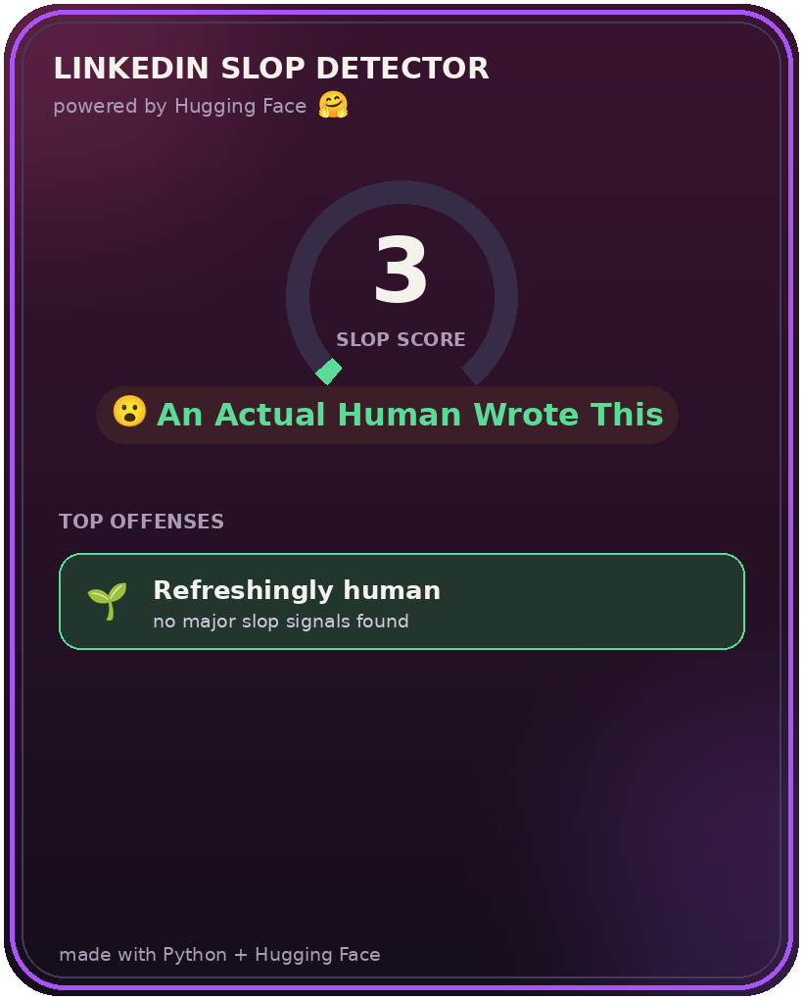

# LinkedIn Slop Detector

This repo is for the **Codédex monthly challenge**. The full tutorial can be found here: **[TUTORIAL.md](https://github.com/anp-exe/codedex-challenge-v2/blob/main/TUTORIAL.md)**.

> [!NOTE]
> If you're here for the tutorial, you'll need to download two files from this repo and drop them into your project folder: the emoji font **[`NotoColorEmoji.ttf`](https://github.com/anp-exe/codedex-challenge-v2/blob/main/NotoColorEmoji.ttf)** (so your card looks the same on every computer) and the card generator **[`card.py`](https://github.com/anp-exe/codedex-challenge-v2/blob/main/card.py)**.

<p align="center">
  
</p>

It's a Python tool that reads any LinkedIn post and gives it a **Slop Score /100** with a verdict, then saves it as 
a shareable card. Along the way you'll learn to use the **Hugging Face API** for zero-shot text classification and blend AI judgment with your own transparent rules.

<p align="center">
  
  
</p>

## Quick start

```bash
python3 -m venv .venv
source .venv/bin/activate
pip install requests python-dotenv Pillow
```

Add your Hugging Face token to a `.env` file (see the [tutorial](https://github.com/anp-exe/codedex-challenge-v2/blob/main/TUTORIAL.md) for how to get one):

```
HF_TOKEN=hf_your_token_here
```

Then run it:

```bash
python slop.py
```

## What's in here

| File | What it does |
|------|--------------|
| `slop.py` | The main detector: rule signals + Hugging Face scoring |
| `card.py` | Draws the shareable score card with Pillow |
| `TUTORIAL.md` | The full step-by-step write-up |
| `images/` | Screenshots and example cards used in the tutorial |

## More resources

- [Hugging Face Inference API docs](https://huggingface.co/docs/api-inference)
- [Zero-shot classification explained](https://huggingface.co/tasks/zero-shot-classification)
- [Pillow documentation](https://pillow.readthedocs.io/)
