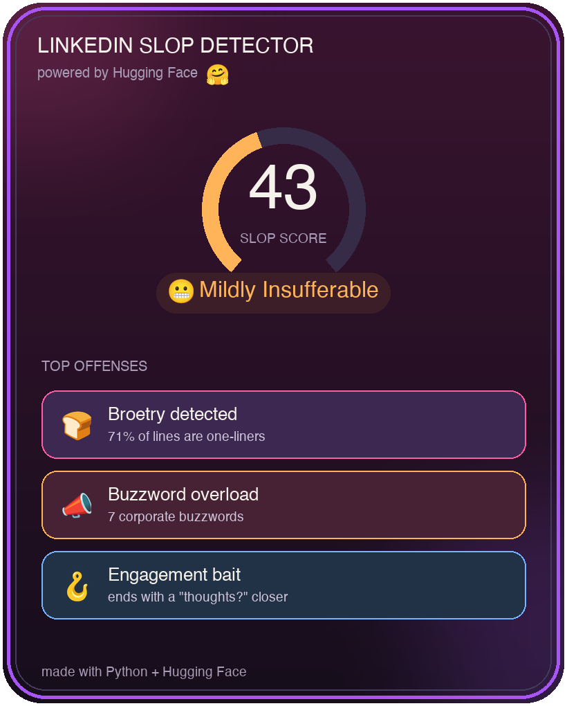

# Build an AI Slop Detector with the Hugging Face API

> **Project Tutorials** / `PYTHON` `AI` `INTERMEDIATE`
>
> **by Anna** ([@anp-exe](https://www.codedex.io/@anp-exe)) ·
>
> 1 hr read
>
> |                   |                                        |
> |-------------------|----------------------------------------|
> | **PREREQUISITES** | Python fundamentals                    |
> | **VERSIONS**      | Python 3.10, requests 2.x, Pillow 10.x |

# Introduction


Are you sick of reading AI slop on LinkedIn? The "I got rejected 100 times. Then everything changed 👇" broetry, the buzzword soup, the "Agree?" bait?

This tool reads any post and gives it a **Slop Score /100**, with a verdict and a breakdown of its biggest offenses, then saves it all as a shareable card.


> **A quick note:** truly detecting whether an AI *wrote* something is famously unreliable, even the paid tools get 
> it wrong. So instead of faking that, we measure how much a post reeks of the **AI-slop *style***: the broetry, the buzzwords, the engagement bait.

In this tutorial you'll learn how to use the **Hugging Face API**!


# What is Hugging Face? 🤗

Hugging Face is a platform for natural language processing (NLP) and machine learning models. They offer tons of pre-trained models for tasks like text classification, sentiment analysis, and language generation, all callable through a simple API. It's huge in AI, and the best part is you can use these models with just a few lines of Python.

## What We're Building

1. **Rule signals**: write functions that sniff out broetry, buzzwords, and engagement bait.
2. **Hugging Face**: use a zero-shot model from HF to score how "performative" a post feels.
3. **Combine** them into a Slop Score with a verdict.
4. **Reward**: drop in a ready-made card generator that turns your score into a shareable image. 🥫

---

## Setup

Grab **Python 3** and **pip**, make a file called `slop.py`, and install what we need:

```bash
pip install requests Pillow python-dotenv
```

- **`requests`** talks to Hugging Face.
- **`Pillow`** draws the card.
- **`python-dotenv`** keeps your token safe (more on that next).

---

## Getting a Hugging Face Token

Hugging Face's **Inference API** lets us run AI models with a simple web request, no GPU, no downloads. We just need a free token:

1. Make a free account at [huggingface.co](https://huggingface.co).
2. Go to **Settings → Access Tokens → New token** (a "Read" token is fine).
3. Copy it (it starts with `hf_`).

> ⚠️ Treat it like a password. Never paste it into your code or commit it to GitHub.

The clean way to use it is a `.env` file. In your project's root folder, create a file called `.env` and add your token on one line, no quotes, no spaces:

```
HF_TOKEN=hf_your_token_here
```

Then in your code we load it like this:

```python
import os
from dotenv import load_dotenv

load_dotenv()                       # reads the .env file
HF_TOKEN = os.environ.get("HF_TOKEN")
```

> 💡 **Important:** add `.env` to your `.gitignore` so your token never gets pushed to GitHub. This is the habit real developers use, your secrets live in `.env`, never in the code.

---

## Step 1: Sniff Out the Slop (Rule Signals)

Before we even touch AI, a lot of "slop" is detectable with simple patterns. Let's write functions that catch the classic tells:

```python
import re

BUZZWORDS = ["humbled","thrilled to announce","excited to share","game-changer",
    "synergy","leverage","move the needle","thought leader","disrupt",
    "growth mindset","deep dive","grateful","blessed","unpopular opinion"]
CLOSERS = ["agree?","thoughts?","who's with me","comment below",
    "what do you think","repost if"]

def _hits(text, phrases):
    t = text.lower()
    return sum(t.count(p) for p in phrases)

def rule_signals(text):
    lines = [l.strip() for l in text.splitlines() if l.strip()]
    # "broetry" = lots of ultra-short one-line paragraphs
    broetry = (sum(1 for l in lines if len(l.split()) <= 5) / len(lines)) if lines else 0
    buzz = _hits(text, BUZZWORDS)
    closers = _hits(text, CLOSERS)
    emoji_bullets = len(re.findall(r"^[\s]*[\U0001F300-\U0001FAFF\u2600-\u27BF]", text, re.M))
    hashtags = len(re.findall(r"#\w+", text))

    # each signal contributes points (capped) -> a 0-60 subscore
    score = (min(20, broetry*28) + min(14, buzz*4) + min(10, closers*6)
             + min(8, emoji_bullets*2) + min(8, max(0, hashtags-2)*2))

    return {"broetry": round(broetry,2), "buzzwords": buzz, "closers": closers,
            "emoji_bullets": emoji_bullets, "hashtags": hashtags,
            "rule_subscore": round(min(60, score),1)}
```

What each signal catches:
- **Broetry** , the fraction of lines that are tiny one-liners (the signature LinkedIn format).
- **Buzzwords** , "humbled," "synergy," "thought leader"...
- **Closers** , engagement bait like "Agree?" and "Thoughts?".
- **Emoji bullets & hashtag pileups** , the decorative overload.

These are *transparent*, you can see exactly why a post scored high, which makes the result feel fair (and funny).

> 📸 *Screenshot: print rule_signals() on a real post.*

---

## Step 2: Bring in the AI (Hugging Face Zero-Shot)

Rules only go so far. To catch the *overall vibe*, we use a **zero-shot classifier** from Facebook, a model that can sort text into labels *we invent on the spot*, without any training. We just hand it our categories:

```python
import requests

HF_MODEL = "facebook/bart-large-mnli"
HF_URL = f"https://router.huggingface.co/hf-inference/models/{HF_MODEL}"

def hf_performative_score(text, token):
    labels = ["humble authentic personal story",
              "performative self-promotional corporate content"]
    payload = {"inputs": text, "parameters": {"candidate_labels": labels}}
    r = requests.post(HF_URL, headers={"Authorization": f"Bearer {token}"},
                      json=payload, timeout=30)
    r.raise_for_status()
    data = r.json()
    # the API returns a list of {"label": ..., "score": ...} dicts
    scores = {item["label"]: item["score"] for item in data}
    return scores.get("performative self-promotional corporate content", 0.0)
```

How **zero-shot classification** works: the model was trained to judge whether one sentence *implies* another. We exploit that by asking "does this post imply the label 'performative self-promotional content'?" and it returns a probability for each label we gave it. No training data needed, that's the magic. We pull out the "performative" probability (a number from 0 to 1).

> 💡 **First-run tip:** free HF models "sleep" when idle, so your very first request might take ~20 seconds while it wakes up. Just run it again, after that it's fast.

> 📸 *Screenshot: the raw Hugging Face response showing the labels + scores.*

---

## Step 3: Combine into a Slop Score

Now we blend the two halves: the rule subscore (0–60) and the AI's performative probability (0–1, scaled to 0–40), for a Slop Score out of 100.

```python
def analyze(text, token):
    sig = rule_signals(text)
    hf = hf_performative_score(text, token)
    score = round(min(100, sig["rule_subscore"] + hf*40))
    return score, sig

def verdict(score):
    if score >= 80: return "Certified Artisanal Slop 🥫"
    if score >= 60: return "Peak LinkedIn Cringe 💼"
    if score >= 40: return "Mildly Insufferable 😬"
    if score >= 20: return "Suspiciously Normal 🤔"
    return "An Actual Human Wrote This 😮"
```

Splitting the score this way is deliberate: even if the AI is unsure, the transparent rules still ground the result, and vice versa. That's a genuinely good pattern for any "AI + heuristics" project.

---

## Step 4: Run It

Now let's wire it together. This reads a post, calls the AI, and prints your Slop Score right in the terminal:

```python
def main():
    if not HF_TOKEN:
        raise SystemExit("No token found. Add HF_TOKEN=hf_... to your .env file.")

    # paste the LinkedIn post you want to score between the triple quotes:
    text = """I got rejected 100 times.

Then everything changed.

Here's what I learned 👇

I'm humbled and grateful to announce I'm now a thought leader.

We need to leverage synergy to move the needle.

Agree?

#motivation #grindset #blessed"""

    score, sig = analyze(text, HF_TOKEN)
    print(f"\n  Slop Score: {score}/100  —  {verdict(score)}\n")

if __name__ == "__main__":
    main()
```

Run it:

```bash
python slop.py
```

And there's your score:

```
  Slop Score: 88/100  —  Certified Artisanal Slop 🥫
```

Try it on a few posts from your feed, the worse the post, the higher the score. 😈 To score a different post, just swap the text between the `"""` triple quotes.

> 📸 *Screenshot: the terminal showing a Slop Score.*

---

## Step 5: Your Reward, a Shareable Card 

A terminal score is fun, but you want something to *post*. So here's your reward: a ready-made card generator that turns your score into a shareable image, the pink slop card you saw at the top.

You don't need to write this part yourself (it's a chunk of [Pillow](https://pillow.readthedocs.io/) drawing code, fun but fiddly). Just grab two files from the project repo and drop them into your folder:

- **`card.py`** , the card generator
- **`NotoColorEmoji.ttf`** , the emoji font, so your card's emoji look the same on every computer

Then add one import at the top of `slop.py`:

```python
from card import make_card
```

And two lines at the end of your `main()`:

```python
    make_card(score, sig)
    print("  Saved your card to slop_card.png 🥫\n")
```

Run `slop.py` again, and a `slop_card.png` appears in your folder, your shareable Slop Score card, ready to post. 🎉

> 

> 💡 **Want to peek inside `card.py`?** Go for it! It uses Pillow to draw a gradient, a circular score meter (with `arc`), rounded corners (with a mask), and the colour emoji. It's a great file to study once you've got the main project working.

---

## Level Up!

- **More signals:** detect the "🧵 thread" opener, ALL CAPS WORDS, or the classic "Let that sink in."
- **Roast mode:** feed the post to a text-generation model for a one-line roast.
- **Browser extension:** score posts right in your LinkedIn feed.
- **Leaderboard:** save the sloppiest posts your friends submit.
- **Web app:** wrap it in Streamlit so anyone can paste and score.

---

## Finally

You just built an **AI Slop Detector**! You learned how to:

- Use the **Hugging Face Inference API** with **zero-shot classification** (invent your own labels, no training!)
- Combine **AI judgment with transparent rule-based heuristics**, a genuinely useful real-world pattern
- Keep your API token safe with a `.env` file
- Turn a result into a polished, shareable card

And you did it!
---

## More Resources
- [Hugging Face Inference API docs](https://huggingface.co/docs/api-inference)
- [Zero-shot classification explained](https://huggingface.co/tasks/zero-shot-classification)
- [Pillow documentation](https://pillow.readthedocs.io/)