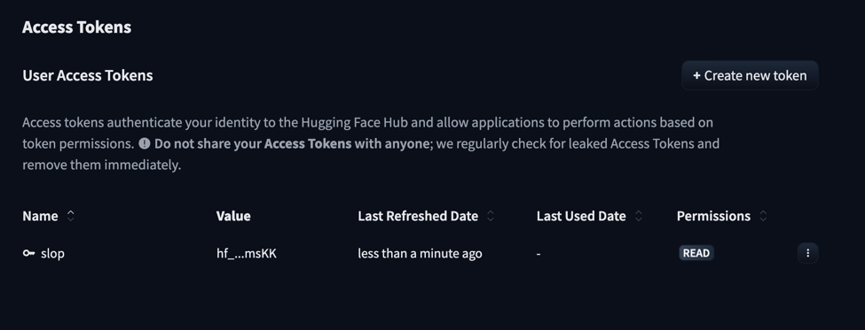
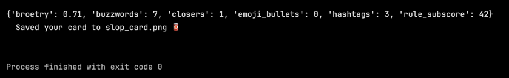
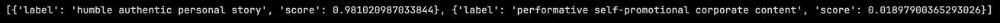
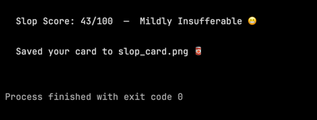

# Build an AI Slop Detector with the Hugging Face API

> **Project Tutorials** / `PYTHON` `AI` `INTERMEDIATE`
>
> **by Anna** ([@anp-exe](https://www.codedex.io/@anp-exe)) ·
>
> 60 min read
>
> |                   |                                        |
> |-------------------|----------------------------------------|
> | **PREREQUISITES** | Python fundamentals                    |
> | **VERSIONS**      | Python 3.10, requests 2.x, Pillow 10.x |

## Introduction


Are you sick of reading AI slop on LinkedIn? The "I got rejected 100 times. Then everything changed 👇" broetry, the buzzword soup, the "Agree?" bait?

In this tutorial, we'll build a tool that reads any post and gives it a **Slop Score /100**, complete with a verdict and a breakdown of its biggest offenses. Then it saves the whole thing as a shareable card.


> **A quick note:** truly detecting whether an AI *wrote* something is famously unreliable. Even the paid tools get it wrong. So instead of faking that, we'll measure how much a post reeks of the **AI-slop *style***: the broetry, the buzzwords, the engagement bait.

Along the way, you'll learn how to use the **Hugging Face API**!

## What is Hugging Face? 🤗

Hugging Face is a platform for natural language processing (NLP) and machine learning models. It offers tons of pre-trained models for tasks like text classification, sentiment analysis, and language generation, all callable through a simple API. It's huge in the AI world, and the best part is you can use these models with just a few lines of Python.

## What We're Building

1. **Rule signals**: functions that sniff out broetry, buzzwords, and engagement bait.
2. **Hugging Face**: a zero-shot model that scores how "performative" a post feels.
3. **A Slop Score**: both halves combined into one number with a verdict.
4. **A reward**: a ready-made card generator that turns your score into a shareable image. 🥫

## Setting Up

For this project, we'll need [Python 3](https://www.python.org/downloads/) and [pip](https://pip.pypa.io/en/stable/) installed.

Create a file called **slop.py**, then install our three packages:

```bash
pip install requests Pillow python-dotenv
```

- **`requests`** talks to Hugging Face.
- **`Pillow`** draws the card.
- **`python-dotenv`** keeps your token safe (more on that next).

## Getting a Hugging Face Token

Hugging Face's **Inference API** lets us run AI models with a simple web request. No GPU, no downloads. We just need a free token:

1. Make a free account at [huggingface.co](https://huggingface.co).
2. Go to **Settings → Access Tokens → New token** (a "Read" token is fine).
3. Copy it (it starts with `hf_`).

You should see something like this:



> ⚠️ Treat your token like a password. Never paste it into your code or commit it to GitHub.

The clean way to use it is a `.env` file. In your project folder, create a file called `.env` and add your token on one line, no quotes, no spaces:

```
HF_TOKEN=hf_your_token_here
```

Then at the top of **slop.py**, we load it like this:

```python
import os
from dotenv import load_dotenv

load_dotenv()                       # reads the .env file
HF_TOKEN = os.environ.get("HF_TOKEN")
```

> 💡 **Important:** add `.env` to your `.gitignore` so your token never gets pushed to GitHub. This is the habit real developers use. Secrets live in `.env`, never in the code.

## Step 1: Sniff Out the Slop (Rule Signals)

Before we even touch AI, a lot of slop is detectable with simple patterns. Let's write functions that catch the classic tells.

First, the phrases we're hunting for:

```python
BUZZWORDS = ["humbled", "thrilled to announce", "excited to share",
    "game-changer", "synergy", "leverage", "move the needle",
    "thought leader", "disrupt", "growth mindset", "deep dive",
    "grateful", "blessed", "unpopular opinion"]

CLOSERS = ["agree?", "thoughts?", "who's with me", "comment below",
    "what do you think", "repost if"]
```

Next, a tiny helper that counts how many times any phrase from a list shows up in the text:

```python
def count_hits(text, phrases):
    text = text.lower()
    return sum(text.count(phrase) for phrase in phrases)
```

Now the main function. It measures five signals and turns them into a subscore out of 60:

```python
def rule_signals(text):
    lines = [line.strip() for line in text.splitlines() if line.strip()]

    # "broetry": what fraction of lines are tiny one-liners?
    short = sum(1 for line in lines if len(line.split()) <= 5)
    broetry = short / len(lines) if lines else 0

    buzzwords = count_hits(text, BUZZWORDS)
    closers = count_hits(text, CLOSERS)

    # lines that open with an emoji (or any non-keyboard character)
    emoji_bullets = sum(1 for line in lines if not line[0].isascii())

    hashtags = text.count("#")

    # each signal adds points, capped so no single one dominates
    score = 0
    score += min(20, broetry * 28)              # broetry is worth up to 20
    score += min(14, buzzwords * 4)             # 4 points per buzzword
    score += min(10, closers * 6)               # 6 points per "Agree?"
    score += min(8, emoji_bullets * 2)          # 2 points per emoji bullet
    score += min(8, max(0, hashtags - 2) * 2)   # 2 free hashtags, then 2 points each

    return {"broetry": round(broetry, 2), "buzzwords": buzzwords,
            "closers": closers, "emoji_bullets": emoji_bullets,
            "hashtags": hashtags, "rule_subscore": round(min(60, score), 1)}
```

Let's break down what each signal catches:

- **Broetry** is the fraction of lines that are tiny one-liners (the signature LinkedIn format). We count the lines with 5 words or fewer and divide by the total.
- **Buzzwords and closers** use our `count_hits()` helper. "Humbled," "synergy," "Agree?"... you know the ones.
- **Emoji bullets** uses a neat trick: `isascii()` is `True` for normal keyboard characters and `False` for emoji. So if a line *starts* with a non-ASCII character, it's almost certainly a ✨ decorative ✨ bullet.
- **Hashtags** is just counting `#` symbols. Everyone gets two for free, then the points start.

Each signal is capped with `min()` so one offense can't max out the score on its own. A post needs to commit *multiple* crimes to reach the top.

These signals are *transparent*: you can see exactly why a post scored high, which makes the result feel fair (and funny).

> 

## Step 2: Bring in the AI (Hugging Face Zero-Shot)

Rules only go so far. To catch the *overall vibe*, we'll use a **zero-shot classifier**: a model that can sort text into labels *we invent on the spot*, without any training. We just hand it our categories.

```python
import requests

HF_MODEL = "facebook/bart-large-mnli"
HF_URL = f"https://router.huggingface.co/hf-inference/models/{HF_MODEL}"

def hf_performative_score(text, token):
    labels = ["humble authentic personal story",
              "performative self-promotional corporate content"]

    payload = {"inputs": text, "parameters": {"candidate_labels": labels}}
    response = requests.post(HF_URL,
                             headers={"Authorization": f"Bearer {token}"},
                             json=payload, timeout=30)
    response.raise_for_status()
    data = response.json()

    # the API returns a list of {"label": ..., "score": ...} dicts
    scores = {item["label"]: item["score"] for item in data}
    return scores.get("performative self-promotional corporate content", 0.0)
```

Let's walk through it:

- We `POST` the post text to Hugging Face along with two labels we made up: "humble authentic personal story" vs "performative self-promotional corporate content."
- The model returns a probability for each label.
- We pull out the "performative" probability, a number from 0 to 1.

So how does **zero-shot classification** work? The model was trained to judge whether one sentence *implies* another. We exploit that by effectively asking "does this post imply the label 'performative self-promotional content'?" No training data needed. That's the magic.

> 💡 **First-run tip:** free Hugging Face models "sleep" when idle, so your very first request might take ~20 seconds while the model wakes up. Just run it again. After that it's fast.

> 

## Step 3: Combine into a Slop Score

Now we blend the two halves: the rule subscore (0 to 60) and the AI's performative probability (0 to 1, scaled to 0 to 40). Together they make a Slop Score out of 100.

```python
def analyze(text, token):
    sig = rule_signals(text)
    hf = hf_performative_score(text, token)
    score = round(min(100, sig["rule_subscore"] + hf * 40))
    return score, sig

def verdict(score):
    if score >= 80: return "Certified Artisanal Slop 🥫"
    if score >= 60: return "Peak LinkedIn Cringe 💼"
    if score >= 40: return "Mildly Insufferable 😬"
    if score >= 20: return "Suspiciously Normal 🤔"
    return "An Actual Human Wrote This 😮"
```

Splitting the score this way is deliberate. Even if the AI is unsure, the transparent rules still ground the result, and vice versa. That's a genuinely useful pattern for any "AI + heuristics" project.

## Step 4: Run It

Time to wire it all together. This reads a post, calls the AI, and prints your Slop Score right in the terminal:

```python
def main():
    if not HF_TOKEN:
        raise SystemExit("No token found. Add HF_TOKEN=hf_... to your .env file.")

    # paste the LinkedIn post you want to score between the triple quotes:
    text = """I got rejected 100 times.

Then everything changed.

Here's what I learned 👇

I'm humbled and grateful to announce I'm now a thought leader.

We need to leverage synergy to move the needle.

Agree?

#motivation #grindset #blessed"""

    score, sig = analyze(text, HF_TOKEN)
    print(f"\n  Slop Score: {score}/100  —  {verdict(score)}\n")

if __name__ == "__main__":
    main()
```

Run it:

```bash
python slop.py
```

And there's your score:

```
  Slop Score: 88/100  —  Certified Artisanal Slop 🥫
```

Try it on a few posts from your feed. The worse the post, the higher the score. To score a different post, just swap the text between the `"""` triple quotes.

> 

## Step 5: Your Reward, a Shareable Card

A terminal score is fun, but you want something to *post*. So here's your reward: a ready-made card generator that turns your score into a shareable image, the pink slop card you saw at the top.

You don't need to write this part yourself (it's a chunk of [Pillow](https://pillow.readthedocs.io/) drawing code, fun but fiddly). Just grab two files from the project repo and drop them into your folder:

- **`card.py`**: the card generator
- **`NotoColorEmoji.ttf`**: the emoji font, so your card's emoji look the same on every computer

Then add one import at the top of **slop.py**:

```python
from card import make_card
```

And two lines at the end of your `main()`:

```python
    make_card(score, sig)
    print("  Saved your card to slop_card.png 🥫\n")
```

Run **slop.py** again, and a **slop_card.png** appears in your folder: your shareable Slop Score card, ready to post. 🎉

> 

> 💡 **Want to peek inside `card.py`?** Go for it! It uses Pillow to draw a gradient, a circular score meter (with `arc`), rounded corners (with a mask), and the colour emoji. It's a great file to study once you've got the main project working.

## Conclusion

You did it!

You learned how to:

- Use the **Hugging Face Inference API** with **zero-shot classification** (invent your own labels, no training!)
- Combine **AI judgment with transparent rule-based heuristics**, a genuinely useful real-world pattern
- Keep your API token safe with a `.env` file
- Turn a result into a polished, shareable card

## What Next?

- **More signals:** detect the "🧵 thread" opener, ALL CAPS WORDS, or the classic "Let that sink in."
- **Browser extension:** score posts right in your LinkedIn feed.
- **Leaderboard:** save the sloppiest posts your friends submit.
- **Web app:** wrap it in Streamlit so anyone can paste and score.

## More Resources

- [Hugging Face Inference API docs](https://huggingface.co/docs/api-inference)
- [Zero-shot classification explained](https://huggingface.co/tasks/zero-shot-classification)
- [Pillow documentation](https://pillow.readthedocs.io/)