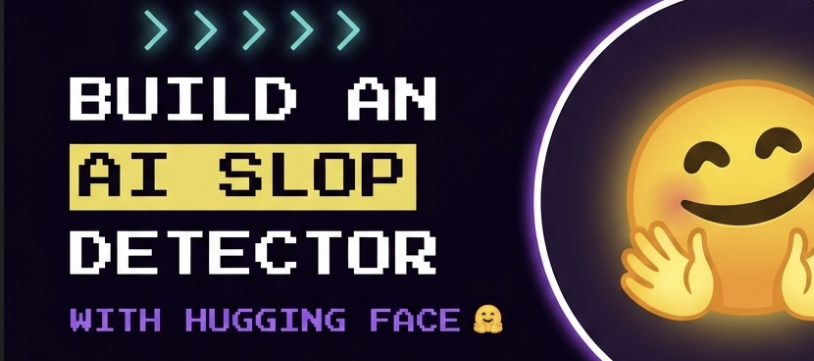
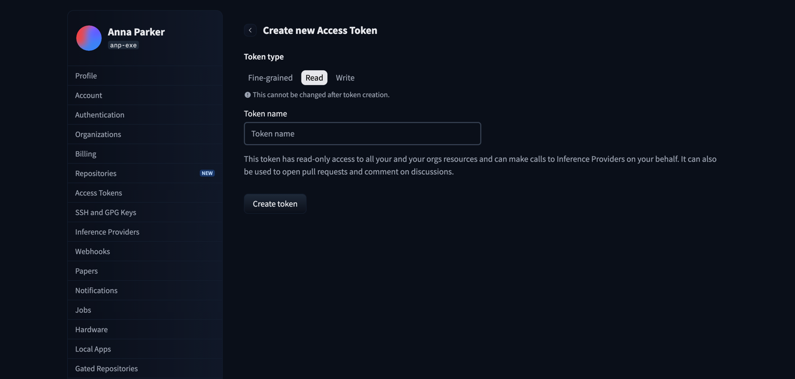

<p align="center">
  
</p>

# Build an AI Slop Detector with the Hugging Face API

> **Project Tutorials** / `PYTHON` `AI` `INTERMEDIATE`
>
> **by Anna** ([@anp-exe](https://www.codedex.io/@anp-exe)) ·
>
> 50 min read
>
> |                   |                                        |
> |-------------------|----------------------------------------|
> | **PREREQUISITES** | Python fundamentals                    |
> | **VERSIONS**      | Python 3.10, requests 2.x, Pillow 10.x |

## Introduction

Are you sick of reading AI slop on LinkedIn? The "I got rejected 100 times. Then everything changed 👇" broetry, the buzzword soup, the "Agree?" bait?

In this tutorial we'll build a tool that gives any post a **Slop Score /100** with a verdict, then saves it as a shareable card.

> **A quick note:** truly detecting whether an AI *wrote* something is famously unreliable, even the paid tools get it wrong. So instead we'll measure how much a post reeks of the **AI-slop *style***: the broetry, buzzwords, and engagement bait.

Along the way you'll learn how to use the **Hugging Face API** for **zero-shot text classification**, and how to blend AI judgment with your own transparent rules.


## What is Hugging Face? 🤗

Hugging Face is a community and platform that hosts a bunch of open source machine learning models, datasets, and more. It offers pre-trained models for tasks like text classification and sentiment analysis, all callable through a simple API with just a few lines of Python.

Let's get started! 🥫

## Setting Up

Create a new directory named `slop-detector`. This is where our project will live. Then enter the directory in your terminal:

```bash
cd slop-detector
```

## Create the Virtual Environment

Let's create a virtual environment, or venv, which is an isolated environment that contains a Python installation alongside our packages:

```bash
python3 -m venv .venv
```

Now activate it:

```bash
source .venv/bin/activate
```

## Install Requests

First we install `requests`, a library to handle HTTP requests. This is what talks to the Hugging Face API.

```bash
pip install requests
```

## Install Dotenv

Next we install `python-dotenv`, which loads environment variables from a file so we can keep our API token out of the code.

```bash
pip install python-dotenv
```

## Install Pillow

Finally we install `Pillow`, the imaging library we'll use at the end to draw a shareable score card.

```bash
pip install Pillow
```

## Getting a Hugging Face Token

The **Inference API** runs AI models with a simple web request. No GPU, no downloads. We just need a free token:

1. Make a free account at [huggingface.co](https://huggingface.co).
2. Go to **Settings → Access Tokens → New token** (a "Read" token is fine).
3. Copy it (it starts with `hf_`).


> Read-only tokens are enough for this project. You don't need to pay for anything.

> ⚠️ Treat your token like a password. Never paste it into your code or commit it to GitHub.

## Create an .env file

Create a file called `.env` at the root of the project. This is where we place our token, on one line, no quotes:

```
HF_TOKEN=hf_your_token_here
```

> 💡 Add `.env` to your `.gitignore` so your token never reaches GitHub. Secrets live in `.env`, never in the code.

## Create the project file

At the root of the folder, create a file called `slop.py`. We'll build it up piece by piece, then see the whole thing at the end.

## Import the libraries and load the token

We're using `requests` to call the API, plus a couple of built-in libraries. We load the token from `.env` and point at our model: `facebook/bart-large-mnli`, a zero-shot classifier.

```python
import os, requests
from dotenv import load_dotenv

load_dotenv()
HF_TOKEN = os.environ.get("HF_TOKEN")
HF_URL = "https://router.huggingface.co/hf-inference/models/facebook/bart-large-mnli"
```

`load_dotenv()` reads the `.env` file, then `os.environ.get("HF_TOKEN")` pulls out our token.

## Add the phrases we're hunting for

A lot of slop is detectable with simple patterns before we even touch AI. Let's list the classic tells: buzzwords and engagement-bait closers.

```python
BUZZWORDS = ["humbled", "thrilled to announce", "synergy", "leverage",
             "thought leader", "grateful", "blessed", "move the needle"]
CLOSERS = ["agree?", "thoughts?", "comment below", "repost if"]
```

These are the phrases that show up in basically every cringe LinkedIn post.

## Add a helper to count phrases

This little function counts how many times any phrase from a list shows up in the text.

```python
def count_hits(text, phrases):
    return sum(text.lower().count(p) for p in phrases)
```

We lowercase the text first so "Synergy" and "synergy" both count, then add up every match.

## Add the rule signals

Now the scoring function. It measures a few signals and turns them into a subscore out of 60.

```python
def rule_signals(text):
    lines = [l.strip() for l in text.splitlines() if l.strip()]
    short = sum(1 for l in lines if len(l.split()) <= 5)
    broetry = short / len(lines) if lines else 0
    emoji_bullets = sum(1 for l in lines if not l[0].isascii())

    score = min(20, broetry * 28)
    score += min(14, count_hits(text, BUZZWORDS) * 4)
    score += min(10, count_hits(text, CLOSERS) * 6)
    score += min(8, emoji_bullets * 2)
    score += min(8, max(0, text.count("#") - 2) * 2)
    return min(60, score)
```

A few things are happening here. **Broetry** is the fraction of lines that are tiny one-liners, the signature LinkedIn format. **Emoji bullets** uses a neat trick: `isascii()` is `False` for emoji, so a line *starting* with one is almost certainly a ✨ decorative ✨ bullet. Each signal is capped with `min()` so no single offense can max out the score on its own. These signals are *transparent*: you can see exactly why a post scored high.

## Query the model

Rules only go so far. To catch the *overall vibe* we'll use a **zero-shot classifier**: a model that sorts text into labels *we invent on the spot*, no training needed. We hand it two labels and pull out the "performative" probability.

```python
def hf_performative_score(text, token):
    labels = ["humble authentic personal story",
              "performative self-promotional corporate content"]
    payload = {"inputs": text, "parameters": {"candidate_labels": labels}}
    r = requests.post(HF_URL, headers={"Authorization": f"Bearer {token}"},
                      json=payload, timeout=30)
    r.raise_for_status()
    scores = {item["label"]: item["score"] for item in r.json()}
    return scores.get(labels[1], 0.0)
```

We `POST` the post text plus our two labels, and the model returns a probability for each. We grab the "performative" one (`labels[1]`, a number from 0 to 1). How does it work? The model was trained to judge whether one sentence *implies* another, so we're effectively asking "does this post imply the label 'performative content'?" That's the magic.

> 💡 **First-run tip:** free models "sleep" when idle, so your first request might take ~20 seconds while the model wakes up. Just run it again.

## Add the verdict

Now a function that maps a score to a verdict, so the number means something at a glance.

```python
def verdict(score):
    if score >= 80: return "Certified Artisanal Slop 🥫"
    if score >= 60: return "Peak LinkedIn Cringe 💼"
    if score >= 40: return "Mildly Insufferable 😬"
    return "An Actual Human Wrote This 😮"
```

Simple thresholds: the higher the score, the worse the verdict.

## Wire it all together

Finally, a `main()` function that runs everything. It guards against a missing token, scores a sample post, blends the two halves (rules out of 60, AI scaled to 40), and prints the result.

```python
def main():
    if not HF_TOKEN:
        raise SystemExit("No token found. Add HF_TOKEN=hf_... to your .env file.")

    text = """I got rejected 100 times.
Then everything changed.
Here's what I learned 👇
I'm humbled and grateful to announce I'm now a thought leader.
We need to leverage synergy to move the needle.
Agree?
#motivation #grindset #blessed"""

    rules = rule_signals(text)
    hf = hf_performative_score(text, HF_TOKEN)
    score = round(min(100, rules + hf * 40))
    print(f"\n  Slop Score: {score}/100  —  {verdict(score)}\n")

if __name__ == "__main__":
    main()
```

Splitting the score this way is deliberate: if the AI is unsure, the transparent rules still ground the result, and vice versa. A genuinely useful pattern for any "AI + heuristics" project. To score a different post, just swap the text between the `"""` triple quotes.

## Run the project

```bash
python slop.py
```

```
  Slop Score: 88/100  —  Certified Artisanal Slop 🥫
```

Try it on posts from your feed. The worse the post, the higher the score.

## Bonus: a shareable card

A terminal score is fun, but you want something to *post*. Grab two files from the project repo and drop them in your folder:

- **[`card.py`](https://github.com/anp-exe/codedex-challenge-v2/blob/main/card.py)**: the card generator
- **`NotoColorEmoji.ttf`**: the emoji font, so your card looks the same on every computer

Add the import at the top of `slop.py`, then call `make_card` at the end of `main()`:

```python
from card import make_card
make_card(score, verdict(score))
```

Run `slop.py` again and a `slop_card.png` appears in your folder, ready to post. 🎉

> 

> 💡 **Want to peek inside [`card.py`](https://github.com/anp-exe/codedex-challenge-v2/blob/main/card.py)?** Go for it. It uses Pillow to draw a gradient, a circular score meter (`arc`), and rounded corners (a mask). A great file to study once the main project works.

## Final Words

You did it! You learned how to use the **Hugging Face Inference API** with **zero-shot classification** (inventing your own labels, no training!), combine **AI judgment with transparent rules** (a useful real-world pattern), keep your API token safe with a `.env` file, and turn a result into a polished, shareable card.

If you keep this innovation up you'll be detecting slop across the entire internet in no time. Thanks for reading!

## What Next?

- **More signals:** detect the "🧵 thread" opener or ALL CAPS WORDS.
- **Browser extension:** score posts right in your LinkedIn feed.
- **Web app:** wrap it in Streamlit so anyone can paste and score.

## More Resources

- [Hugging Face Inference API docs](https://huggingface.co/docs/api-inference)
- [Zero-shot classification explained](https://huggingface.co/tasks/zero-shot-classification)
- [Pillow documentation](https://pillow.readthedocs.io/)