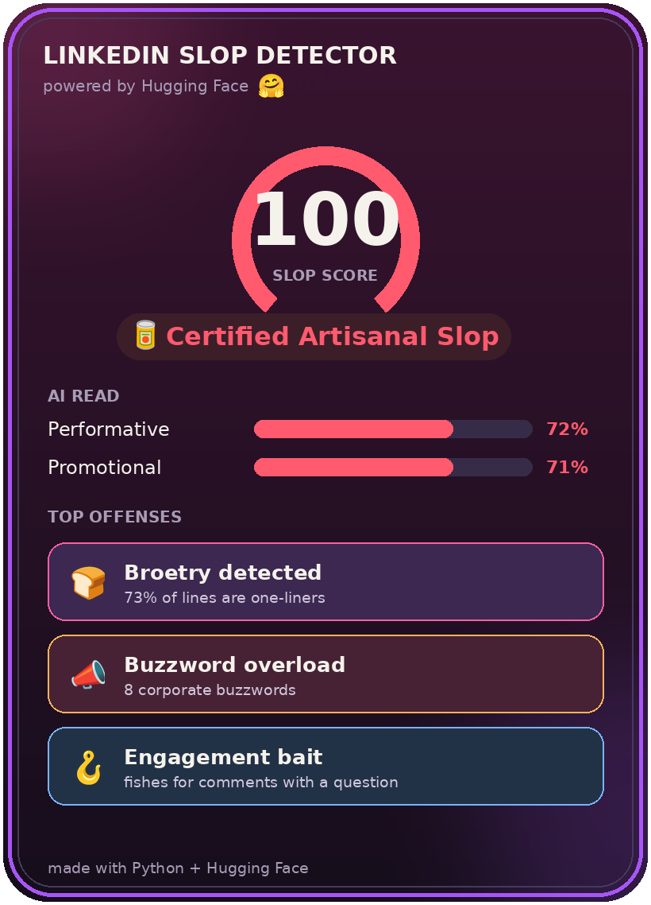

<p align="center">
  
</p>

# Build an AI Slop Detector with the Hugging Face API

> **Project Tutorials** / `PYTHON` `AI` `INTERMEDIATE`
>
> **by Anna** ([@anp-exe](https://www.codedex.io/@anp-exe)) ·
>
> 50 min read
>
> |                   |                                        |
> |-------------------|----------------------------------------|
> | **PREREQUISITES** | Python fundamentals, Git & GitHub      |
> | **VERSIONS**      | Python 3.10, requests 2.x, Pillow 10.x |

## Introduction

Ever heard of the **dead internet theory**? It's the idea that more and more of what we read online isn't written by
people at all but churned out by AI. Whether or not you buy the full conspiracy, one place it feels undeniably true
is **LinkedIn**. The feed has become ground zero for AI slop. "I got rejected 100 times. Then everything changed"
broetry, the buzzword soup, the "Agree?" bait, all of it identical.

In this tutorial we'll build a tool that gives any post a **Slop Score /100** with a verdict, then saves it as a shareable card. Along the way you'll learn how to use the **Hugging Face API** for **zero-shot text classification**, and how to blend AI judgment with your own transparent rules.

> 

## What is Hugging Face? 🤗

Hugging Face is a community and platform that hosts a bunch of open source machine learning models, datasets, and more. It offers pre-trained models for tasks like text classification and sentiment analysis, all callable through a simple API with just a few lines of Python.

Let's get started! 🥫

<p> 
    
</p>

## Setting Up

Create a new directory named `slop-detector`. This is where our project will live. Then enter the directory in your terminal:

```bash
cd slop-detector
```

### Create the Virtual Environment

Let's create a virtual environment, or venv, which is an isolated environment that contains a Python installation alongside our packages:

```bash
python3 -m venv .venv
```

Now activate it:

```bash
source .venv/bin/activate
```

### Install the project dependencies

First we install [`requests`](https://requests.readthedocs.io/), a library to handle HTTP requests. This is what talks to the Hugging Face API.

```bash
pip install requests
```

Next we install [`python-dotenv`](https://saurabh-kumar.com/python-dotenv/), which loads environment variables from a file so we can keep our API token out of the code.

```bash
pip install python-dotenv
```

Finally we install [`Pillow`](https://pillow.readthedocs.io/), the imaging library we'll use at the end to draw a shareable score card.

```bash
pip install Pillow
```

### Getting a Hugging Face Token

> [!WARNING]
> Treat your token like a password. Never paste it into your code or commit it to GitHub.

The **Inference API** runs AI models with a simple web request. No GPU, no downloads. We just need a free token:

1. Make a free account at [huggingface.co](https://huggingface.co).
2. Go to **Settings → Access Tokens → Create new token → Select "Read" token type**.
3. Copy it (it starts with `hf_`).


### Create an .env file

> [!TIP]
> Add `.env` to your `.gitignore` so your token never reaches GitHub. Secrets live in `.env`, never exposed in the code.

Create a dotfile called `.env` at the root of the project. This is where we place our token, on one line, no quotes:

```env
HF_TOKEN=hf_your_token_here
```

**I cannot see the dotfile I've created!**

On Unix systems (e.g., macOS and Linux), the dot makes them "hidden" by default. However, they're simply files you can view and edit that start with a dot (`.`). If you're unable to see them, it means you need to [make them visible on your file explorer](https://www.graphpad.com/support/faq/how-to-view-files-on-your-mac-that-are-normally-invisible/).

## Creating the `slop.py` file

At the root of the folder, create a file called `slop.py`. We'll build it up piece by piece, then see the whole thing at the end.

### Import the libraries and load the token

We're using `requests` to call the API, plus a couple of built-in libraries. We load the token from `.env` and point at our model: `facebook/bart-large-mnli`, a zero-shot classifier.

```python
import os, requests
from dotenv import load_dotenv

load_dotenv()
HF_TOKEN = os.environ.get("HF_TOKEN")
HF_URL = "https://router.huggingface.co/hf-inference/models/facebook/bart-large-mnli"
```

`load_dotenv()` reads the `.env` file, then `os.environ.get("HF_TOKEN")` pulls out our token.

### Create your deterministic signals

These helpers each measure one slop signal the same way every time, no AI, no randomness. That's what makes them *deterministic*: they're fully within our control, and we can extend them however we like. We'll add them one at a time.

First up, the corporate buzzwords. We keep the word list right inside the function and count how many appear, lowercasing the text first so "Synergy" and "synergy" both count:

```python
def count_corporate_buzzwords(text):
    BUZZWORDS = ["humbled", "thrilled to announce", "synergy", "leverage",
                 "thought leader", "grateful", "blessed", "move the needle"]
    return sum(text.lower().count(b) for b in BUZZWORDS)
```

The `BUZZWORDS` list lives inside the function since nothing else needs it.

Next, the engagement-bait closers, the lines that beg for a reaction. We count them, plus a point if the whole post ends on a question:

```python
def engagement_bait(text):
    CLOSERS = ["agree?", "thoughts?", "comment below", "repost if"]
    hits = sum(text.lower().count(c) for c in CLOSERS)
    return hits + 1 if text.strip().endswith("?") else hits
```

Keeping `CLOSERS` inside the function ties the list to its only user.

Now the dashes LLMs love, em-dashes, en-dashes, and spaced hyphens. A few are perfectly normal, so instead of the raw count we return how many a post runs *over* a 3-dash grace:

```python
def excess_dashes(text):
    DASHES = ["—", "–", " - "]
    total = sum(text.count(d) for d in DASHES)
    return max(0, total - 3)
```

So three or fewer dashes scores `0` here, and the scoring line stays focused on a plain `excess_dashes(text)` with no threshold math inline.

Next, anaphora, repeated line-openers (the "Culture is built when... / No more X..." pattern):

```python
def anaphora_hits(text):
    from collections import Counter
    lines = [l.strip() for l in text.splitlines() if l.strip()]
    starts = Counter(" ".join(l.lower().split()[:2]) for l in lines if len(l.split()) >= 2)
    return sum(c for c in starts.values() if c >= 2)
```

This groups lines by their first two words and counts any opener that repeats, since a real person rarely starts three lines exactly the same way.

Then broetry, the fraction of lines that are tiny one-liners:

```python
def broetry_ratio(text):
    lines = [l.strip() for l in text.splitlines() if l.strip()]
    short = sum(1 for l in lines if len(l.split()) <= 6)
    # only trust the ratio once there are enough lines to be meaningful
    return short / len(lines) if len(lines) >= 6 else 0
```

> [!NOTE]
> Here, we decided to only trust the ratio once a post has at least 6 lines.
>
> Broetry is a long post chopped into many tiny lines. The thing we're actually trying to catch is a *wall* of short, punchy one-liners. In a 2- or 3-line post, a single short line already pushes the fraction to "100%," even though that's just a normal short message, not the pattern. Rather than flag those as slop, we return `0` until there are enough lines for the ratio to mean anything.

Finally, emoji bullets, lines that start with an emoji:

```python
def emoji_bullets(text):
    lines = [l.strip() for l in text.splitlines() if l.strip()]
    return sum(1 for l in lines if not l[0].isascii())
```

A quick trick: `isascii()` is `True` only for plain English letters, digits, and basic punctuation, so it returns `False` for an emoji. That means a line *starting* with one usually gets flagged as a ✨ decorative ✨ bullet. It won't *only* catch emoji, an accented letter like `é` or a curly quote at the start trips it too, but for LinkedIn-style posts that's a good-enough tell.

### Score the deterministic signals

`main()` will collect every raw signal value into one `signals` map (we build it in a moment). `score_signals` takes that map and turns it into two numbers: a weighted **score** (*how much* slop) and an **offense count** (*how many* tells fired).

```python
def score_signals(signals):
    score = min(20, signals["broetry"] * 28)
    score += min(14, signals["buzzwords"] * 4)
    score += min(12, signals["closers"] * 6)
    score += min(12, signals["emoji_bullets"] * 2)
    score += min(8, signals["dashes"] * 3)
    score += min(12, signals["anaphora"] * 3)

    offenses = sum([
        signals["broetry"] >= 0.4,
        signals["buzzwords"] >= 1,
        signals["closers"] >= 1,
        signals["emoji_bullets"] >= 2,
        signals["dashes"] > 0,
        signals["anaphora"] >= 2,
    ])

    return min(80, score), offenses
```

**The score** is a weighted sum, capped at 80. Each `min()` cap is that signal's weight, so no single tell can run away with the score.

**The offense count** answers a different question: not *how big* the total is, but *how many* separate tells fired. One signal maxing out can spike the score, yet a post that trips several is the surer sign of slop. Each `>=` is a threshold check that lands on `True` or `False`, and because [Python booleans are just integers](https://docs.python.org/3/library/functions.html#bool) (`True` is `1`, `False` is `0`), `sum([...])` just counts how many tripped.

Passing the map in keeps things tidy: `main()` builds the raw values once, and the score, the offense count, and the card all read from that single source.

### Create your non-deterministic signals

Rules only go so far. To catch the *overall vibe* we'll use a [zero-shot classifier](https://en.wikipedia.org/wiki/Zero-shot_learning): a model that sorts text into labels *we invent on the spot*, no training needed. Unlike the deterministic helpers above, these signals come from an AI model, so they read meaning the rules miss.

First, one small helper that makes the call. We hand the model the post plus two labels, and it returns a probability for each; we keep the second one (`labels[1]`, a number from 0 to 1):

```python
def zero_shot(text, labels, token):
    payload = {"inputs": text, "parameters": {"candidate_labels": labels}}
    r = requests.post(HF_URL, headers={"Authorization": f"Bearer {token}"},
                      json=payload, timeout=30)
    r.raise_for_status()
    scores = {item["label"]: item["score"] for item in r.json()}
    return scores.get(labels[1], 0.0)
```

How does it work? The model was trained to judge whether one sentence *implies* another, so we're effectively asking "does this post imply the label?" That's the magic.

Now each AI signal is just a label pair handed to `zero_shot`, the same way each rule signal kept its word list inside. The first measures how much the post reads as a self-promotional brag:

```python
def performative_score(text, token):
    labels = ["a modest low-key update",
              "a self-promotional brag"]
    return zero_shot(text, labels, token)
```

The second measures how much it reads as a promotional announcement rather than a genuine personal anecdote:

```python
def promotional_score(text, token):
    labels = ["a personal anecdote",
              "a promotional announcement"]
    return zero_shot(text, labels, token)
```

The labels are doing a lot of work here, so choose them carefully: describe what the post observably **is**, a *genre* the model already understands, not the conclusion you want. Asking "is this *AI-generated filler*?" barely moves the needle (this model has no concept of "AI-generated"); asking "is this *a promotional announcement*?" works great, because LinkedIn slop usually *is* a promo.

> [!TIP]
> **First-run tip:** free models "sleep" when idle, so your first request might take ~20 seconds while the model wakes up. Just run it again. Each signal is its own call, so the first run can wake the model up twice.

### Score the non-deterministic signals

Just like `score_signals`, this scorer takes a map. `main()` builds an `ai_signals` map of the probabilities, and we blend its values into a single 0-1 "vibe", here a plain average:

```python
def score_ai_signals(ai_signals):
    return sum(ai_signals.values()) / len(ai_signals)
```

Averaging the map's values keeps it open-ended: to add a third AI signal later you write one new `*_score` helper and add one line to the `ai_signals` map, the scorer itself never changes.

## Wire it all together

`main()` ties everything together. It builds two maps from the helper functions, `signals` for the rules and `ai_signals` for the AI probabilities, passes each to its scorer (`score_signals` for the rule score and offense count, `score_ai_signals` for the AI vibe), then blends the two halves: if no signal tripped, it trusts the AI alone (kept low), otherwise it scales the rules-plus-AI blend up by 1.4 to use the full range. A short `if`/`elif` ladder then turns the final number into a verdict label right where it's printed, no need to split that into its own function, it's easier to follow inline.

```python
def main():
    # paste your own post between the triple quotes!
    text = """I got rejected 100 times.
Then everything changed.
We need to leverage synergy to move the needle.
Culture is built when teams win.
Culture is built when people care.
Agree?
#motivation #grindset #blessed"""

    signals = {
        "broetry": broetry_ratio(text),
        "buzzwords": count_corporate_buzzwords(text),
        "closers": engagement_bait(text),
        "emoji_bullets": emoji_bullets(text),
        "dashes": excess_dashes(text),
        "anaphora": anaphora_hits(text),
    }
    ai_signals = {
        "performative": performative_score(text, HF_TOKEN),
        "promotional": promotional_score(text, HF_TOKEN),
    }

    rules, offenses = score_signals(signals)
    vibe = score_ai_signals(ai_signals)

    if offenses == 0:
        score = round(vibe * 25)                            # no tells: lean on the AI, kept low
    else:
        score = round(min(100, (rules + vibe * 40) * 1.4))  # otherwise use the full range

    if score >= 70:   label = "Certified Artisanal Slop 🥫"
    elif score >= 50: label = "Peak LinkedIn Cringe 💼"
    elif score >= 30: label = "Mildly Insufferable 😬"
    elif score >= 15: label = "Suspiciously Normal 🤔"
    else:             label = "An Actual Human Wrote This 😮"

    print(f"\n  Slop Score: {score}/100  —  {label}\n")

if __name__ == "__main__":
    main()
```

Two ideas make this robust. The `signals` map holds every raw value, built once in `main()`, and `score_signals` reads it to hand back an offense count that gates the verdict: a post with zero tripped signals can't be slop, so we lean on the AI alone and keep the score low. Everything else gets the full blended score, scaled up so the mid-range fills in. To score a different post, just swap the text between the `"""` triple quotes.

## Run the project

```bash
python slop.py
```

```
  Slop Score: 87/100  —  Certified Artisanal Slop 🥫
```

Try it on posts from your feed. The worse the post, the higher the score.

## Bonus: a shareable card

A terminal score is fun, but you want something to *post*. Grab two files from the project repo and drop them in your folder:

- **[`card.py`](https://github.com/anp-exe/detect-ai-slop-tutorial/blob/main/card.py)**: the card generator
- **[`NotoColorEmoji.ttf`](https://github.com/anp-exe/detect-ai-slop-tutorial/blob/main/NotoColorEmoji.ttf)**: the emoji font, so your card looks the same on every computer

You already built the `signals` and `ai_signals` maps in `main()`, so the card just needs two lines. Add the import at the top of `slop.py`:

```python
from card import make_card
```

then call it at the very end of `main()`, passing the score, the rule signals (for the top offenses), and the AI signals (for the "AI read" bars):

```python
    make_card(score, signals, ai_signals)
```

Run `slop.py` again and a `slop_card.png` appears in your folder, ready to post. 🎉


## Final Words

You did it! You learned how to use the **Hugging Face Inference API** with **zero-shot classification** (inventing your own labels, no training!), combine **AI judgment with transparent rules** (a useful real-world pattern), keep your API token safe with a `.env` file, and turn a result into a polished, shareable card.

Now more than ever, creativity is the thing that makes you stand out. When the baseline is an infinite scroll of interchangeable AI posts, a genuine voice, an original idea, a sentence that sounds like an actual human, cuts through. So go build, go write, go post like a real person. Thanks for reading!

## What Next?

- **Tune the weights:** change the `min()` caps in `score_signals` and watch how the scores move. Which tells do you think deserve to matter most?
- **Beat your high score:** hunt your feed for the most egregious post you can find and see how close to 100 you can push it.
- **Add your own signals:** detect the ALL CAPS WORDS or whatever tell drives *you* up the wall, then give it a weight and a card box.

## More Resources

- [Hugging Face Inference API docs](https://huggingface.co/docs/api-inference)
- [Zero-shot classification explained](https://huggingface.co/tasks/zero-shot-classification)
- [Pillow documentation](https://pillow.readthedocs.io/)
