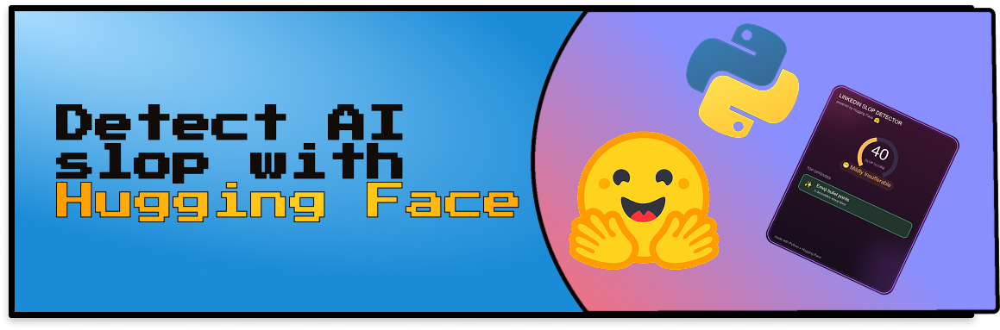
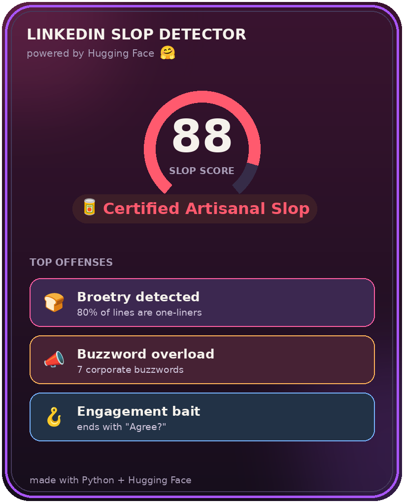

<p align="center">
  
</p>

# Build an AI Slop Detector with the Hugging Face API

> **Project Tutorials** / `PYTHON` `AI` `INTERMEDIATE`
>
> **by Anna** ([@anp-exe](https://www.codedex.io/@anp-exe)) ·
>
> 50 min read
>
> |                   |                                        |
> |-------------------|----------------------------------------|
> | **PREREQUISITES** | Python fundamentals, Git & GitHub      |
> | **VERSIONS**      | Python 3.10, requests 2.x, Pillow 10.x |

## Introduction

Ever heard of the **dead internet theory**? It's the idea that more and more of what we read online isn't written by 
people at all but churned out by AI. Whether or not you buy the full conspiracy, one place it feels undeniably true 
is **LinkedIn**. The feed has become ground zero for AI slop. "I got rejected 100 times. Then everything changed" 
broetry, the buzzword soup, the "Agree?" bait, all of it identical.

In this tutorial we'll build a tool that gives any post a **Slop Score /100** with a verdict, then saves it as a shareable card. Along the way you'll learn how to use the **Hugging Face API** for **zero-shot text classification**, and how to blend AI judgment with your own transparent rules.

> 

## What is Hugging Face? 🤗

Hugging Face is a community and platform that hosts a bunch of open source machine learning models, datasets, and more. It offers pre-trained models for tasks like text classification and sentiment analysis, all callable through a simple API with just a few lines of Python.

Let's get started! 🥫

<p> 
    
</p>

## Setting Up

Create a new directory named `slop-detector`. This is where our project will live. Then enter the directory in your terminal:

```bash
cd slop-detector
```

## Create the Virtual Environment

Let's create a virtual environment, or venv, which is an isolated environment that contains a Python installation alongside our packages:

```bash
python3 -m venv .venv
```

Now activate it:

```bash
source .venv/bin/activate
```

## Install Requests

First we install [`requests`](https://requests.readthedocs.io/), a library to handle HTTP requests. This is what talks to the Hugging Face API.

```bash
pip install requests
```

## Install Dotenv

Next we install [`python-dotenv`](https://saurabh-kumar.com/python-dotenv/), which loads environment variables from a file so we can keep our API token out of the code.

```bash
pip install python-dotenv
```

## Install Pillow

Finally we install [`Pillow`](https://pillow.readthedocs.io/), the imaging library we'll use at the end to draw a shareable score card.

```bash
pip install Pillow
```

## Getting a Hugging Face Token

The **Inference API** runs AI models with a simple web request. No GPU, no downloads. We just need a free token:

1. Make a free account at [huggingface.co](https://huggingface.co).
2. Go to **Settings → Access Tokens → New token** (a "Read" token is fine).
3. Copy it (it starts with `hf_`).


> [!NOTE]
> Read-only tokens are enough for this project. You don't need to pay for anything.

> [!WARNING]
> Treat your token like a password. Never paste it into your code or commit it to GitHub.

## Create an .env file

Create a file called `.env` at the root of the project. This is where we place our token, on one line, no quotes:

```
HF_TOKEN=hf_your_token_here
```

> [!TIP]
> Add `.env` to your `.gitignore` so your token never reaches GitHub. Secrets live in `.env`, never in the code.

## Create the project file

At the root of the folder, create a file called `slop.py`. We'll build it up piece by piece, then see the whole thing at the end.

## Import the libraries and load the token

We're using `requests` to call the API, plus a couple of built-in libraries. We load the token from `.env` and point at our model: `facebook/bart-large-mnli`, a zero-shot classifier.

```python
import os, requests
from dotenv import load_dotenv

load_dotenv()
HF_TOKEN = os.environ.get("HF_TOKEN")
HF_URL = "https://router.huggingface.co/hf-inference/models/facebook/bart-large-mnli"
```

`load_dotenv()` reads the `.env` file, then `os.environ.get("HF_TOKEN")` pulls out our token.

## Create your deterministic signals

These helpers each measure one slop signal the same way every time, no AI and no randomness, which is what makes them *deterministic*. We'll add them one at a time.

First, a reusable counter for how many phrases from a list appear in the text:

```python
def count_hits(text, phrases):
    return sum(text.lower().count(p) for p in phrases)
```

We lowercase first so "Synergy" and "synergy" both count, and we'll reuse this for several signals.

Next, the engagement-bait closers (the lines that beg for a reaction) and a function that counts them, plus a point if the whole post ends on a question:

```python
CLOSERS = ["agree?", "thoughts?", "comment below", "repost if"]

def engagement_bait(text):
    hits = count_hits(text, CLOSERS)
    if text.strip().endswith("?"):
        hits += 1
    return hits
```

Defining `CLOSERS` right next to the function that uses it keeps the list and its purpose together.

Now count the dashes LLMs love, em-dashes, en-dashes, and spaced hyphens:

```python
def count_dashes(text):
    return text.count("—") + text.count("–") + text.count(" - ")
```

More than three of these in a post is a strong AI tell.

Next, anaphora, repeated line-openers (the "Culture is built when... / No more X..." pattern):

```python
def anaphora_hits(text):
    from collections import Counter
    lines = [l.strip() for l in text.splitlines() if l.strip()]
    starts = Counter(" ".join(l.lower().split()[:2]) for l in lines if len(l.split()) >= 2)
    return sum(c for c in starts.values() if c >= 2)
```

This groups lines by their first two words and counts any opener that repeats, since a real person rarely starts three lines exactly the same way.

Then broetry, the fraction of lines that are tiny one-liners:

```python
def broetry_ratio(text):
    lines = [l.strip() for l in text.splitlines() if l.strip()]
    short = sum(1 for l in lines if len(l.split()) <= 6)
    # only trust the ratio once there are enough lines to be meaningful
    return short / len(lines) if len(lines) >= 6 else 0
```

We only trust the ratio once a post has at least 6 lines, otherwise a 2-line post reads as "100% broetry" off a tiny sample.

Finally, emoji bullets, lines that start with an emoji:

```python
def emoji_bullets(text):
    lines = [l.strip() for l in text.splitlines() if l.strip()]
    return sum(1 for l in lines if not l[0].isascii())
```

A neat trick: `isascii()` is `False` for an emoji, so a line *starting* with one is almost certainly a ✨ decorative ✨ bullet.

## Add the rule signals

One more list first, the corporate buzzwords, defined right where the scoring will use them:

```python
BUZZWORDS = ["humbled", "thrilled to announce", "synergy", "leverage",
             "thought leader", "grateful", "blessed", "move the needle"]
```

Now the [scoring function](https://en.wikipedia.org/wiki/Scoring_rule). It calls each signal helper and turns them into a subscore out of 80. Each `min()` cap is that signal's weight, so no single tell can run away with the score.

```python
def rule_signals(text):
    dashes = count_dashes(text)
    score = min(20, broetry_ratio(text) * 28)
    score += min(14, count_hits(text, BUZZWORDS) * 4)
    score += min(12, engagement_bait(text) * 6)
    score += min(12, emoji_bullets(text) * 2)
    score += min(12, max(0, text.count("#") - 2) * 2)
    score += min(8, max(0, dashes - 3) * 3)
    score += min(12, anaphora_hits(text) * 3)
    return min(80, score)
```

Because each signal is its own function, this reads almost like a checklist: weight the broetry, the buzzwords, the engagement bait, the emoji bullets, the hashtags, the dashes, and the anaphora, cap each one, and add them up. These signals are *transparent*: you can see exactly why a post scored high.

## Count the offenses

We also want to know *how many* signals tripped, not just the total. This count gates the verdict later: if nothing tripped, we shouldn't call a post slop no matter what the AI thinks. It reads the `signals` dict we'll build in `main()` in a moment.

```python
def offense_count(signals):
    flags = [
        signals["broetry"] >= 0.4,
        signals["buzzwords"] >= 1,
        signals["closers"] >= 1,
        signals["hashtags"] >= 4,
        signals["emoji_bullets"] >= 2,
        signals["dashes"] > 3,
        signals["anaphora"] >= 2,
    ]
    return sum(flags)
```

Each line is a simple threshold check, and `sum()` counts how many came back `True` (Python treats `True` as 1).

## Create your non-deterministic signals

Rules only go so far. To catch the *overall vibe* we'll use a [zero-shot classifier](https://en.wikipedia.org/wiki/Zero-shot_learning): a model that sorts text into labels *we invent on the spot*, no training needed. Unlike the deterministic helpers above, this signal comes from an AI model, so it can read meaning the rules miss. We hand it two labels and pull out the "performative" probability.

```python
def hf_performative_score(text, token):
    labels = ["humble authentic personal story",
              "performative self-promotional corporate content"]
    payload = {"inputs": text, "parameters": {"candidate_labels": labels}}
    r = requests.post(HF_URL, headers={"Authorization": f"Bearer {token}"},
                      json=payload, timeout=30)
    r.raise_for_status()
    scores = {item["label"]: item["score"] for item in r.json()}
    return scores.get(labels[1], 0.0)
```

We `POST` the post text plus our two labels, and the model returns a probability for each. We grab the "performative" one (`labels[1]`, a number from 0 to 1). How does it work? The model was trained to judge whether one sentence *implies* another, so we're effectively asking "does this post imply the label 'performative content'?" That's the magic.

> [!TIP]
> **First-run tip:** free models "sleep" when idle, so your first request might take ~20 seconds while the model wakes up. Just run it again.

## Wire it all together

First, one tiny self-explanatory helper that turns the final number into a label:

```python
def verdict(score):
    if score >= 70: return "Certified Artisanal Slop 🥫"
    if score >= 50: return "Peak LinkedIn Cringe 💼"
    if score >= 30: return "Mildly Insufferable 😬"
    if score >= 15: return "Suspiciously Normal 🤔"
    return "An Actual Human Wrote This 😮"
```

Now `main()` ties everything together. It scores a sample post, builds the `signals` dict straight from our helper functions, then blends the two halves: if no offense boxes tripped, it trusts the AI alone (kept low), otherwise it scales the rules-plus-AI blend up by 1.4 to use the full range.

```python
def main():
    # 👇 paste your own post between the triple quotes!
    text = """I got rejected 100 times.
Then everything changed.
We need to leverage synergy to move the needle.
Culture is built when teams win.
Culture is built when people care.
Agree?
#motivation #grindset #blessed"""

    rules = rule_signals(text)
    hf = hf_performative_score(text, HF_TOKEN)

    signals = {
        "broetry": broetry_ratio(text),
        "buzzwords": count_hits(text, BUZZWORDS),
        "closers": engagement_bait(text),
        "hashtags": text.count("#"),
        "emoji_bullets": emoji_bullets(text),
        "dashes": count_dashes(text),
        "anaphora": anaphora_hits(text),
    }

    if offense_count(signals) == 0:
        score = round(hf * 25)                            # no tells: lean on the AI, kept low
    else:
        score = round(min(100, (rules + hf * 40) * 1.4))  # otherwise use the full range

    print(f"\n  Slop Score: {score}/100  —  {verdict(score)}\n")

if __name__ == "__main__":
    main()
```

Two ideas make this robust. The `signals` dict holds every raw signal, and `offense_count` reads it to gate the verdict: a post with zero tripped signals can't be slop, so we lean on the AI alone and keep the score low. Everything else gets the full blended score, scaled up so the mid-range fills in. To score a different post, just swap the text between the `"""` triple quotes.

## Run the project

```bash
python slop.py
```

```
  Slop Score: 43/100  —  Mildly Insufferable 😬
```

Try it on posts from your feed. The worse the post, the higher the score.

## Bonus: a shareable card

A terminal score is fun, but you want something to *post*. Grab two files from the project repo and drop them in your folder:

- **[`card.py`](https://github.com/anp-exe/detect-ai-slop-tutorial/blob/main/card.py)**: the card generator
- **[`NotoColorEmoji.ttf`](https://github.com/anp-exe/detect-ai-slop-tutorial/blob/main/NotoColorEmoji.ttf)**: the emoji font, so your card looks the same on every computer

You already built the `signals` dict in `main()`, so the card just needs two lines. Add the import at the top of `slop.py`:

```python
from card import make_card
```

then call it at the very end of `main()`, passing the score and the signals it uses to draw your top offenses:

```python
    make_card(score, signals)
```

Run `slop.py` again and a `slop_card.png` appears in your folder, ready to post. 🎉

> 

> [!TIP]
> **Want to peek inside [`card.py`](https://github.com/anp-exe/detect-ai-slop-tutorial/blob/main/card.py)?** Go for it. It uses Pillow to draw a gradient, a circular score meter (`arc`), and rounded corners (a mask). A great file to study once the main project works.

## Final Words

You did it! You learned how to use the **Hugging Face Inference API** with **zero-shot classification** (inventing your own labels, no training!), combine **AI judgment with transparent rules** (a useful real-world pattern), keep your API token safe with a `.env` file, and turn a result into a polished, shareable card.

Now more than ever, creativity is the thing that makes you stand out. When the baseline is an infinite scroll of interchangeable AI posts, a genuine voice, an original idea, a sentence that sounds like an actual human, cuts straight through. So go build, go write, go post like a real person. Thanks for reading!

## What Next?

- **More signals:** detect the "thread" opener or ALL CAPS WORDS.
- **Browser extension:** score posts right in your LinkedIn feed.
- **Web app:** wrap it in Streamlit so anyone can paste and score.

## More Resources

- [Hugging Face Inference API docs](https://huggingface.co/docs/api-inference)
- [Zero-shot classification explained](https://huggingface.co/tasks/zero-shot-classification)
- [Pillow documentation](https://pillow.readthedocs.io/)
