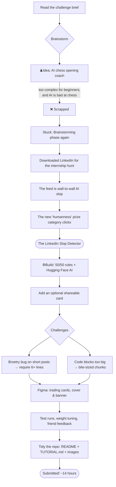
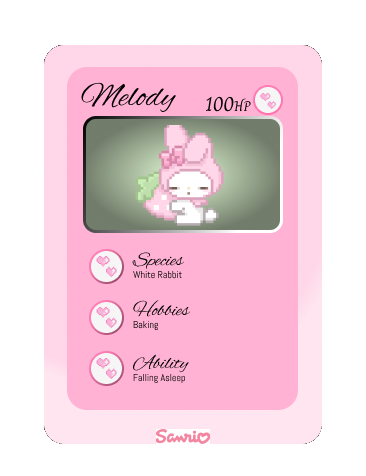
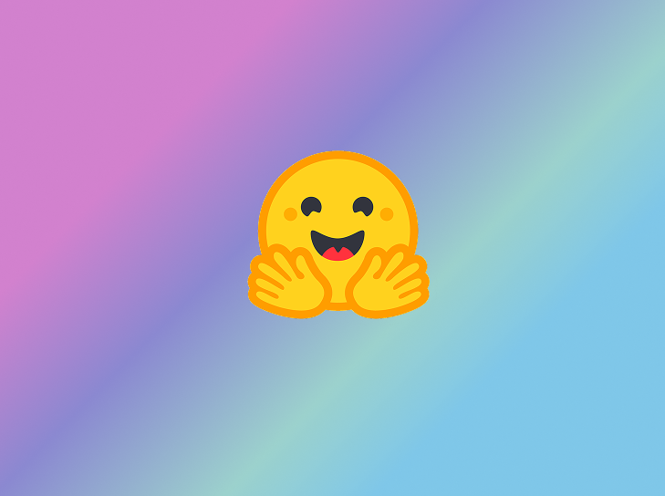

# Building the LinkedIn Slop Detector

*A Codédex monthly challenge walkthrough.*

> The full behind-the-scenes of how I built my entry for the Codédex monthly challenge: an AI-powered **LinkedIn Slop Detector**. From the first brainstorm to the final submission, roughly **14 hours** (per WakaTime), one infuriating bug, and a crash course in Figma.

## The process at a glance

---

## Phase 1: Brainstorming

Codédex is marketed towards Gen Z to teach them how to program. It's fun, engaging, and intuitive, a little bit different from the other platforms. There are entertaining projects spanning AI, data science, and even building a Minecraft mod. After reading the project tutorial brief, I got to work brainstorming.

As a hobby I love doing data journalism projects, so my first instinct was to make another pandas or data-visualisation piece, probably something off my Lego data project. But I wanted a challenge. It is a monthly *"challenge"* after all.

### The first idea (and why it died)

My first real idea was an **AI chess opening coach**. After a draft, I scrapped it: it felt a little too complex for beginners, and AI is notoriously bad at chess.

Okay, so now what?

### Stuck

I got a little stuck and ran out of ideas. I even tried brainstorming with Claude. Nothing.

### The internship hunt that cracked it open

I'd recently downloaded LinkedIn, because the time had come to start the internship hunt 😔. As I scrolled my feed, everything read the same. Every connection request read the same. The intellectually stimulating content I expected was severely lacking, even from my own university.

And hey, I'm not saying AI is a bad tool, but it's clear that some people simply ask it *"write me a post on topic X"* and then post it. I want to read posts about what **YOU** think.

Then I saw the new prize category, and that's how the idea clicked. I think we're all starting to value humanness more.

**💡 The LinkedIn Slop Detector:** a tool that reads a post and scores how much it reeks of AI slop.

I really like the Hugging Face platform, so I scrolled to the project tutorial section on Codédex and saw there was already a Hugging Face tutorial. But people were saying it no longer works. I saw this as a great opportunity: people are interested, there's no working Hugging Face project up, and I'm an AI student. Now I had my fun idea.

---

## Phase 2: Design decisions

**Motivation at the finish line.** I always get motivated by having something to show at the end, so that's where the **shareable scoreable card** idea came from, rather than just a terminal score. You can still get the terminal score and reap the same benefits of learning to call the Hugging Face API, so the card was kept **optional** rather than part of the main event.

AI detection can be unreliable, so I kept the scoring a deliberate **50/50 split** between deterministic rules and the non-deterministic AI model. Then I scrolled Hugging Face and found my model: a zero-shot classifier from Facebook (`bart-large-mnli`).

---

## Phase 3: Challenges

### The broetry bug (and the lesson that came with it)

It seemed to be working well, but I noticed that on **short posts** the slop score would be very high for something nearly, obviously, not AI. For example:

> It was nice to meet everyone today!
> I had a great time!

This would score highly because of the **broetry** signal. It counted the lines as 100% broetry and maxed out that weight. The fix was a **minimum line count of 6**, below which broetry is set to 0 and doesn't affect the final score.

> **The big lesson, don't over-rely on AI to fix your bug.** While debugging this, I leaned on AI to solve it and it just kept adding more lines, more lists, more functions, none of which solved the problem. I lost about an hour and had to revert to the last commit. Then, line by line, I built a grid of all the weights and adjusted them, and *that's* when the fix clicked. It's so important to know when to use AI and when not to. I truly believe it's an **assistive tool, not a programmer**. Trash in = trash out.

### Code blocks too big

Some of my code blocks were too big, so I broke them up into **bite-sized chunks with explanations**, just like the lessons on Codédex.

---

## Phase 4: Design & Figma

Now the banner and cover art. I am *not* a designer. But Codédex has lovely art on their project tutorials and banners, and if I was going for the **LGTM prize** I needed to have the fewest edits. Well, it's not called a challenge for nothing.

Luckily, Codédex has a Figma course! So I went through it and made my trading cards.

It was definitely out of my comfort zone, but fun, and now I'm equipped to make a banner for my project (it won't be amazing after only 3 hours of learning, but still!).

I also studied the covers that show up before you click in. I noticed the AI projects usually use a logo in the centre over a solid or gradient background, so I matched that look.

---

## Phase 5: Testing & feedback

After many, many test runs, with weights changed and wording fixed (for example, framing the two halves as *deterministic* and *non-deterministic*), I had a friend do a test run and give feedback.

Wording changed again, and so did the code. For instance, the `BUZZWORDS` and `CLOSERS` lists were defined at the very beginning, but `BUZZWORDS` wasn't used until much later, which made for a confusing read, so each list got moved next to the function that uses it.

**Instant feedback matters.** I think it's really important for beginners to get that instant feedback, both from a friend and from the tool itself.

---

## Phase 6: Tidying the repo & shipping

I tidied the repo: a **README** explaining the project with links right at the beginning (just in case someone following from Codédex got lost), a separate **TUTORIAL.md**, and a folder for the images. And voilà, a monthly challenge entry.

What a journey. Roughly **14 hours** on this project, according to WakaTime.

---
